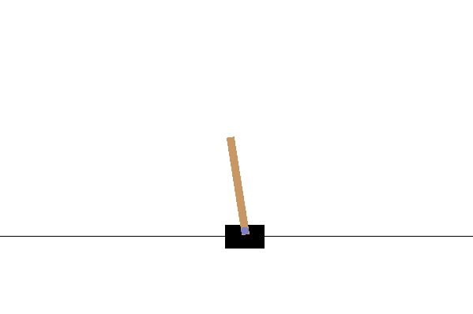
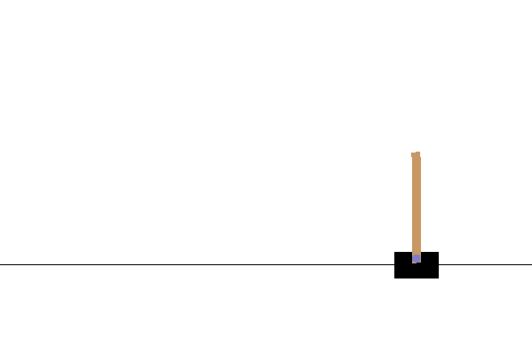

# CartPole-v1 Advantage Actor Critic (A2C)

CartPole-v1 is an environment presented by OpenAI Gym. In this repository we have used Advantage Actor Critic (A2C) algorithm  for building an agent to solve this environment.

### Commands to run
#### To train the model
python train_model.py

#### To test the model
<code>python test_model.py 'path_of_saved_model_weights'</code> (without quotes)

To test agent with our trained weights: <code>python test_model.py saved_model/500.0.h5</code>

### Results

#### Output of agent taking random actions

#### Output of our agent at Episode: 85 with score 500.0

